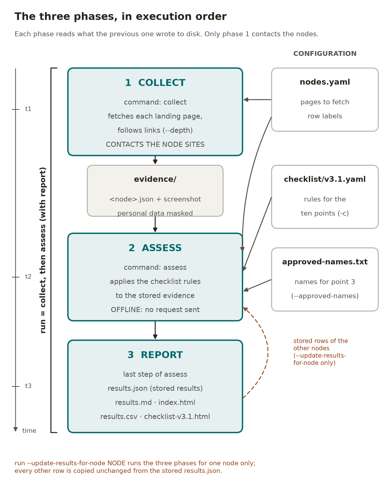

# Analysis workflow

What the test suite actually does, step by step, when it assesses a node against
the **Node Landing Page Verification Checklist v3.0**.

This document is written against the code in `src/basic_check/` as it stands, not
against the design intent. Where the implementation is weaker than the checklist
wording, that is stated rather than smoothed over — the point of this document is
that a reviewer can predict the verdict before running the tool, and can tell
which verdicts are worth trusting. It was last checked against commit `6423432`
on 26 September 2026: every `file.py:line` reference below points at the current
source, and the figures quoted from runs say which run they come from.

Reading order: sections 1–4 describe the machinery shared by every point;
section 5 gives the decision procedure for each of the ten points individually;
section 6 lists the known ways the machinery can be wrong; section 7 describes
the output; section 8 gives three worked examples — adding a node, changing a
node's URL, and moving to a new checklist revision — with every command.

---

## 1. The three stages

The tool is deliberately split so that **no judgement is ever made against a live
website**. Evidence is captured once, written to disk, and every verdict is then
derived from that file.

| Stage | Command | Reads | Writes | Network |
|---|---|---|---|---|
| 1. Collect | `collect` | `nodes.yaml` | `results/evidence/<node>.json` (personal data masked), `results/evidence/screenshots/<node>.png` | yes |
| 2. Assess | `assess` | evidence JSON + `checklist/v3.0.yaml` | `results/results.json` | **no** |
| 3. Report | (part of `assess`) | the run dict in memory, masked again before rendering | `index.html`, `results.md`, `results.csv`, `checklist-v3.0.html` | no |

`run` is stages 1–3 in one invocation. `points` and `show` are inspection
commands and assess nothing.

Two consequences of the split matter in practice:

- **A verdict can be re-derived without touching the node's server.** After a
  checklist reinterpretation or a bug fix, re-running `assess` against the stored
  evidence regenerates every verdict offline, and the new report can be diffed
  against the old one.
- **The checks cannot see anything the collector did not record.** If a fact is
  not in `PageEvidence`, no check can use it — see section 3.

### The phases in time, their options, and what to re-run



The phases run strictly in this order, and each one reads only what the one
before it wrote to disk. **Collect** is the only phase that contacts the nodes.
It reads `nodes.yaml` and writes `evidence/<node>.json` and a screenshot per
node. **Assess** reads that evidence, the checklist and the approved-name list,
and sends no request. **Report** is the last step of `assess`: it writes
`results.json`, `results.md`, `index.html`, `results.csv` and
`checklist-v3.0.html`. `run` performs the three in one invocation. With
`--update-results-for-node`, `run` does the same for one node only, and
`results.json` supplies every other row unchanged. `points` and `show` only
read, so they never need re-running.

**Options of each phase.** ✓ means the command accepts the option. Every
command also takes `--help`.

| Option | `collect` | `assess` | `run` | What it does |
|----------------------|:------:|:------:|:------:|----------------------------------------|
| `--nodes`, `-n <file>` | ✓ | ✓ | ✓ | Node list to use instead of `nodes.yaml` |
| `--results <dir>` | ✓ | ✓ | ✓ | Folder to write to or read from instead of `results/` |
| `--only <ids>` | ✓ | ✓ | ✓ | Fetch only these node ids |
| `--skip <ids or names>` | ✓ | ✓ | ✓ | Leave these nodes out entirely; the report says so |
| `--url <url>` | ✓ | ✓ | ✓ | Check a page not in `nodes.yaml` (writes to `results/one-off/`) |
| `--eosc-page <url>` | ✓ | ✓ | ✓ | With one `--url`: that node's own `eosc.eu` page, for point 4 |
| `--node <id or name>` | ✓ | ✓ | ✓ | One configured node at the alternative page given with `--url` |
| `--delay <s>` | ✓ | — | ✓ | Seconds between hosts (default 2.0) |
| `--depth 0/1/2` | ✓ | — | ✓ | How far to follow links (default 1) |
| `--max-children <n>` | ✓ | — | — | Linked pages followed per node at depth 1 (default 8; `run` always uses 8) |
| `--fetch-budget <n>` | ✓ | — | ✓ | Depth 2 only: ceiling on second-hop requests (default 60) |
| `--checklist`, `-c <file>` | — | ✓ | ✓ | Checklist revision to apply (default `checklist/v3.0.yaml`) |
| `--approved-names <file>` | — | ✓ | ✓ | Approved-name list for point 3 (default `checklist/approved-names.txt`) |
| `--no-approved-names` | — | ✓ | ✓ | Use no name list at all |
| `--strict-separators` | — | ✓ | ✓ | Match separators in approved names literally |
| `--run <label>` | — | ✓ | ✓ | Label recorded in every report (default: UTC time) |
| `--update-results-for-node <node>` | — | ✓ | ✓ | Update only that node's row in the stored results; `assess` re-judges its saved evidence, `run` fetches it again |
| `--accept-error` | — | — | ✓ | With `--update-results-for-node`: merge the row even if the fetch failed |

**What to launch again after a change.** Which phase has to be repeated depends
on which input changed. A change to `nodes.yaml` needs a new collection for the
nodes concerned. A change to the checklist or to the name list needs only a new
assessment, which is offline. `--update-results-for-node` refuses when the
checklist or the approved-name list differs from the stored results', because
a row judged by other rules would not be comparable with the others. In those
cases, every row is assessed again from its stored evidence.

| You change | Launch again | Sites contacted | The other nodes' rows |
|----------------------------|----------------------------|--------------|----------------------------|
| **Add a node**: an entry in `nodes.yaml` and its approved name in `checklist/approved-names.txt` (and `-scoped.txt`) | `collect --only <new id>`, then `assess` without `--only` | the new node only | Re-judged, offline, from their stored evidence, because the approved-name list used for point 3 changed |
| **Add a node** whose approved name is already in `checklist/approved-names.txt` | `run --update-results-for-node <new id>` | the new node only | Kept unchanged; the new row is inserted in `nodes.yaml` order |
| **Change a node's landing page URL** (`basic-check --update-nlp <id> <URL>`, or by hand) | `run --update-results-for-node <id>` | that node only | Kept unchanged |
| **Go back to the node list as downloaded** (`basic-check --restore-default-config`) | For each node it lists as `URL restored`: `run --update-results-for-node <id>`. If it lists nodes added back or removed: `assess` | the restored nodes only | Kept unchanged; re-judged offline if nodes were added back or removed |
| **Change the reference checklist** (a new `checklist/vX.Y.yaml`, made the default in `DEFAULT_CHECKLIST` or passed with `-c`) | `assess` | none | All re-judged, offline, from the stored evidence |

`assess` alone is not enough after a URL change. The node's evidence still
comes from the old page, so `assess` warns and both reports carry an **Evidence
from a different URL** banner. After a checklist change, a new `collect` (or a
full `run`) is needed only if the new revision asks for something the collector
does not record (section 3), or if you want a fresh
capture date. For the full procedure of each case, with every file and
command, see the worked examples in section 8. Each command writes to
`results/`, the reviewed run, by default. Add `--results /tmp/copy` to work on
a copy first, and keep `--skip Italy` for the same scope as the published run.
With an explicit `--results`, `--only` also narrows the report to those nodes,
which is why the table runs `assess` without it.

---

## 2. Stage 1 — collection

Per node, in order:

1. **`robots.txt` for the landing page host** (`_robots`, `fetch.py:194`).
   Fetched with a plain HTTP client (`httpx`, not the browser), with the tool's
   own User-Agent string. Three outcomes:
   - disallowed → `error = "not fetched: robots.txt disallows it"`, evidence
     record returned immediately, **every point becomes `ERROR`**. This is not
     hypothetical: on a trial run on 25 September 2026, BBMRI-ERIC's new
     `dev3.` address served `User-agent: *` / `Disallow: /`, and all ten of its
     points were `ERROR`;
   - HTTP ≠ 200 → treated as "nothing disallowed", proceed;
   - unreachable → proceed with one request, and the reason is recorded in
     `robots_note`. A network failure is not read as permission, but it is also
     not read as a prohibition.
2. **Render in a real browser.** Chromium via Playwright, viewport 1440×1000,
   locale `en-GB`, `Accept-Language: en-GB,en;q=0.9`. Navigation waits for
   `domcontentloaded` (45 s cap), then gives `networkidle` a bounded 2.5 s chance,
   then a fixed 1.2 s settle. Institutional sites run analytics that never let the
   network go idle, so the wait is bounded and whatever has rendered is taken.
   Rendering rather than plain HTTP matters: several of these landing pages are
   client-side rendered, and an HTML fetch would see an empty shell and report the
   node as having no content — a false accusation produced by the tool.
3. **Record status, final URL and redirect chain.** Redirects are captured from
   response events (first 10 kept).
4. **Extract the evidence** from the rendered DOM (`_extract`, `fetch.py:211`).
   `script`, `style`, `noscript` and `template` are removed first. Then:
   - `full_text` — all body text, whitespace-collapsed;
   - `main_text` — text of the first of `main`, `[role=main]`, `article`,
     `#content`, `.content`, falling back to `body`. Kept separate so a cookie
     banner or a language switcher cannot sway language detection;
   - `links` — every `a[href]` except `javascript:` and bare `#`, resolved to
     absolute URLs; if the anchor has no text, a nested `img`'s `alt` is used as
     its label;
   - `images` — every `img` (`src`, `alt`, `aria-label`, `title`, `class`) plus
     every `svg` (its text content as the label);
   - `controls` — every `button`, `a[href]`, `input[type=submit]` and
     `[role=button]` that has a label, taken from its text, its `aria-label` or
     its `value`;
   - `title`, `lang_attr` (the `html` element's `lang`), `meta_description`.
5. **Screenshot** the viewport (not the full page) to
   `results/evidence/screenshots/<node>.png`. Nothing in the assess stage reads
   the screenshot; it exists for the human reviewer. It captures the visible
   viewport, not the full page, so it cannot be used to confirm the absence of
   anything — a footer link is real but off-image.
6. **Depth 1, if requested.** `select_children` (`fetch.py:414`) picks which links
   to follow. A link qualifies only if it is `http(s)`, is not a binary by
   extension, is on the node's own host or a related host, and its combined link
   text and URL path matches the vocabulary of a point that a second page can
   settle. The vocabulary is defined once in `patterns.py` and consumed by both
   the crawler and the checks, so the crawler cannot fail to fetch something a
   check would have accepted.

   The purposes, in the order they consume budget:

   | Order | Point | Vocabulary |
   |---|---|---|
   | 1 | 5b | Acceptable Use Policy, AUP, terms of use/service, conditions of use, user agreement |
   | 2 | 5c | user access policy, UAP, access policy, conditions of access, access conditions |
   | 3 | 6 | helpdesk, help desk, service desk, support, ticket, contact, get in touch |
   | 4 | 2 | about, who we are, our mission, mission |

   Caps: `MAX_PER_PURPOSE = 2`, `MAX_CHILDREN = 8` per node (overridable with
   `--max-children`), 1.2 s between child requests. Each child page carries
   `selected_for`, the list of points it was fetched for, and every link that was
   matched but dropped is recorded in `children_skipped` **with the reason**. That
   list is the difference between "checked and absent" and "never looked".

   Child pages are fetched more cheaply than the landing page: 25 s timeout,
   600 ms settle, no `networkidle` wait, no screenshot.

7. **Depth 2, if requested.** Only from children that rendered — a child that
   failed has no trustworthy links. Meaner caps: `MAX_PER_PURPOSE_D2 = 1`,
   at most 2 grandchildren per child, a run-wide fetch budget of 60, 1.5 s
   between requests. A URL already fetched for this node is never fetched twice.
   `robots.txt` is consulted per host at this level too, cached one fetch per host
   per run, because following links reaches hosts the landing page never named.

   When depth 2 was used, the assess stage runs **both** the full assessment and
   an assessment of the same evidence with the second hop stripped
   (`without_depth_2`), storing the latter as `results_depth_1`. The report can
   then show what the extra requests actually changed instead of asserting they
   were worth making.

8. **Write** the whole record as JSON.

---

## 3. What the evidence contains — and what it does not

`PageEvidence` (`fetch.py:126`) holds: `node_id`, `node_name`, `requested_url`,
`fetched_at`, `final_url`, `http_status`, `redirect_chain`, `robots_allowed`,
`robots_note`, `title`, `lang_attr`, `main_text`, `full_text`, `links`, `images`,
`controls`, `meta_description`, `error`, `screenshot`, `crawl_depth`, `children`,
`children_skipped`, `crawl_note`.

`Image` holds only `src`, `alt`, `aria_label`, `title`, `css_class`, `inline_svg`.
`Link` holds `href`, `text`, `visible`. `Control` holds `text`, `href`, `tag`.

**No geometry, visibility or computed style is captured anywhere.**
`getBoundingClientRect`, `offsetWidth` and `getComputedStyle` do not appear in
`src/`. This is the single most consequential gap in the design, and it is why
point 3 can never be closed automatically: the checklist asks whether a logo is
*visibly displayed*, and the tool has recorded nothing about visibility. It knows
an element exists in the markup. It does not know whether a human would see it.

Likewise, a logo delivered as a CSS `background-image`, as an SVG sprite
reference, or from a file whose name does not contain `eosc`, is invisible to the
tool. Its absence from the evidence is not evidence of absence.

Every string in the evidence is saved with personal data masked (`privacy.py`,
through `write_evidence` in `fetch.py`). Personal addresses become
`XXXXX@domain`, phone numbers become `+CC XXXXXX`, and a name next to a masked
address becomes `XXXXX`. Role mailboxes are kept. The checks therefore run on
masked text, which costs nothing: point 6 needs a helpdesk, and no check uses a
person's address or number. Re-assessing the 24 September evidence after masking
gave the same verdict in all 120 cells, and the published run has been masked
this way since commit `ada1b4a`. The reports are masked a second time as they
are written (`write_all` in `report.py`), so a report rebuilt from evidence
captured before masking existed is masked too. Screenshots are not masked.

---

## 4. Stage 2 — the assessment machinery

`checks.run_all(ev, approved_names, expected_eosc_page)` calls exactly ten
functions in checklist order and returns exactly ten `Result` records. The
mapping between checklist point ids and check functions is asserted to be total
in both directions by the test suite, so a point cannot be silently unassessed
and a function cannot assess a point that no longer exists.

A `Result` carries `point_id`, `title`, `verdict`, `message`, `evidence` (a list
of strings), and `reviewer_action`.

### The verdict vocabulary

| Verdict | Meaning |
|---|---|
| `PASS` | Satisfied, and the tool can show why |
| `FAIL` | Violated, and the tool can show why |
| `MANUAL_REVIEW` | A human must decide; evidence is attached to make that fast |
| `ERROR` | The tool could not assess at all (page unreachable, robots disallowed) |

`MANUAL_REVIEW` is the load-bearing one. Several checklist points turn on phrases
like "clearly state", or quantify over "all research resources offered by the
Node". Neither is settleable by inspecting one page, and emitting `PASS` or
`FAIL` on them would be a guess dressed as a verdict. A wrong `FAIL` against a
named organisation is expensive to retract, so where the tool cannot know, it
says so and hands over the evidence.

### The first step of every check

Every one of the ten functions begins the same way:

```
if ev.error:  ->  ERROR
```

So a node whose landing page could not be fetched at all returns ten `ERROR`
cells, never a mix of passes and a failure.

### Shared helpers

| Helper | Line | What it does |
|---|---|---|
| `_match(text, patterns)` | 58 | Returns the matched substring for each pattern that hits |
| `_link_hits(ev, patterns)` | 67 | Links whose `"{text} {href}"` matches any pattern |
| `_fmt(link)` | 76 | Renders a link as `"label" -> href` for the evidence list |
| `_is_host(netloc, domain)` | 164 | Exact host **or true subdomain**. Rejects `myeosc.eu` and `not-eosc.eu`, which a naive `endswith` would accept |
| `_verify_child(ev, point, …)` | 571 | The child page that was followed for this point, or `None` |
| `_policy_check(...)` | 578 | The whole decision procedure shared by points 5b and 5c |
| `render_warning(ev)` | — | Reason to distrust *absence of text* on this page |
| `link_collection_warning(ev)` | — | Reason to distrust *absence of a link* |

### The two absence gates — and why there are two

Concluding "absent" from an incomplete capture is the most damaging mistake this
kind of tool can make, because the output is an accusation against a named
organisation. So absence-based `FAIL`s are gated. But the two kinds of absence
need different gates.

**`render_warning`** asks *did the page render enough to read?* It fires when a
cookie-consent overlay dominates the captured text (consent markers present and
`main_text` under 1200 chars), when fewer than 25 links were captured, or when
`main_text` is under 600 chars. This is the right question for a judgement about
prose and the **wrong** question for a link.

**`link_collection_warning`** asks only *did the DOM arrive?* It fires when no
links at all were captured, when `len(links) + len(images) + len(controls) < 10`
(`DOM_ELEMENT_FLOOR`), or when `full_text` is under 500 chars
(`EMPTY_DOCUMENT_CHARS`). Text length is not evidence about DOM delivery — a small
page is not a truncated one.

The distinction came from a real case. One node in this set serves 530 characters
of main text behind a cookie banner but 20 anchors — exactly the 20 in the
server's HTML, and 21 in the rendered DOM both before and after accepting
consent. Gating a link-absence `FAIL` on text length let a genuinely verified
absence escape as "cannot conclude". The absence of an `eosc.eu` link there is a
fact about the node, not an artefact of collection.

Where a `FAIL` stands despite a render warning, `_render_note` appends the caveat
to the evidence: the verdict is not suppressed, but the reviewer is told a
consent banner was in the way so the finding can be spot-checked.

---

## 5. Per-point decision procedures

Ten points, ten functions. For each: the steps taken, the branch conditions in
evaluation order, and the verdict each branch yields.

---

### Point 1 — NLP publicly accessible, or reachable via EOSC AAI

`check_1`. Decided almost entirely on HTTP status.

**Steps:** read `http_status`; measure `len(full_text)`; on a 401/403, search
`full_text` for login vocabulary and `final_url` for AAI markers, then search
`full_text + title` for bot-wall wording.

| # | Condition | Verdict |
|---|---|---|
| 1 | `error` set | `ERROR` |
| 2 | 2xx **and** `full_text` > 200 chars | `PASS` — branch (a) satisfied |
| 3 | 401/403 **and** a login affordance found | `MANUAL_REVIEW` — branch (b) may apply, but whether that login is EOSC AAI cannot be read off the page |
| 4 | 401/403, no login affordance | `MANUAL_REVIEW` |
| 5 | 404 or 410 | `FAIL` — the registered URL does not resolve to a page |
| 6 | ≥ 500 | `MANUAL_REVIEW` — often transient, not recorded as a failure without a retry |
| 7 | any other ≥ 400 | `MANUAL_REVIEW` |
| 8 | 2xx but ≤ 200 chars | `MANUAL_REVIEW` — may need JavaScript the tool did not run, or be a shell |

Branch 4 deserves its own note, because it looks like it should be a failure and
is not. A bare 403 to an automated client is far more often bot mitigation than
an access policy — genuine access control almost always redirects to a login.
This was not hypothetical: a node in this set served HTTP 200 to the tool and
then 403 once the crawl made a handful more requests. Reporting that as "not
publicly accessible" would have been the tool blaming a node for its own request
rate. The same node returned 200 again hours later to a run from an address that
had made no requests that day, settling all four of its review cells — so the
abstention was not merely cautious, it was correct, and a `FAIL` would have
stood as a wrong verdict about a named organisation. The evidence records any bot-protection wording found (`cloudflare`,
`just a moment`, `ray id`, `captcha`, …) and the reviewer action is to open the
URL in an ordinary browser.

---

### Point 1R — resources behind the landing page are public or behind EOSC AAI

`check_1R`. **Returns `MANUAL_REVIEW` unconditionally** (unless `error`).

**Steps:**

1. Take the landing page host from `final_url`.
2. Collect every link whose host differs from it and is not `eosc.eu` or a
   subdomain (via `_is_host`).
3. Group those by host, listing up to 12 hosts with up to 3 distinct link labels
   each, so the reviewer sees distinct destinations rather than 90 URLs.
4. Search `full_text` and all `href`s for AAI markers (`eosc-aai`, `aai.eosc`,
   `myaccessid`, `egi check-in`, `aai.egi.eu`, …) and list any found.
5. If depth ≥ 1, report how many followed child pages were served anonymously,
   and name up to 5 that were not.

The point quantifies over every resource reachable through the landing page,
including through intermediate pages, and whether a given login is genuinely
EOSC AAI compliant is settled during EEN enrolment rather than by reading HTML.
One level of crawling narrows this; it cannot close it. The output is a worklist,
not a verdict.

---

### Point 2 — scope, intended users and responsible organisation stated

`check_2`. **Returns `MANUAL_REVIEW` unconditionally** (unless `error`).

**Steps:**

1. Take the first 600 characters of `main_text`, falling back to `full_text`.
2. Add the `meta` description if present (first 200 chars).
3. Find organisation-like names by regex: up to four capitalised words followed
   by a legal-entity or institutional suffix — `ERIC`, `e.V.`, `GmbH`, `Ltd`,
   `Foundation`, `Institute`, `Institut`, `University`, `Universit[eéà]`,
   `Consortium`, `Association`, `Council`, `Agency`, `Centre`, `Center`, `CNRS`,
   `CNR`, `CSC`. Up to six are listed; if none match, that is stated explicitly.
4. If an About page was followed at depth 1 and rendered, quote its opening 260
   characters — **clearly marked as one level down**, because the checklist asks
   the *landing page* to state these things and an About page cannot satisfy it
   on the page's behalf.

Whether the prose conveys scope, intended users and the responsible organisation
to a researcher is a reading judgement. The check's job is to make that reading
take thirty seconds instead of five minutes.

---

### Point 3 — EOSC logo and official node name visible

`check_3`. **Returns `MANUAL_REVIEW` on both branches** (unless `error`).

**Steps:**

1. For every captured image and inline SVG, build the haystack
   `"{src} {alt} {aria_label} {title} {css_class}"` — but with the **host part of
   `src` removed**, so a node served from a host containing "eosc" does not match
   on every locally-hosted image. The path and query survive, so
   `eosc-node-final.webp` still counts. "eosc" must then appear as a token, not
   inside a longer word: `geoscience` and `neoscope` do not match, while the
   official lockups `EOSCNode_Finland.jpg` and `EOSCNodeBBMRIERIC_ColourPos.png`
   do, because CamelCase is treated as a word break. Separately, an asset genuinely
   served from `eosc.eu` counts via a host check, so a cross-host node logo —
   correct behaviour — is still found, while `myeosc.eu` is not.
2. For each hit, record the kind (`img` or `inline SVG`) and a label, preferring
   `alt`, then `aria_label`, then `title`, then the filename.
3. Take the names that apply to *this* node — those written as `node-id: Name`,
   then any unscoped ones — and test each against `full_text` in file order. The
   list is `checklist/approved-names.txt` unless `--approved-names` replaces it
   or `--no-approved-names` suppresses it. Each word of a name is matched
   literally and case-insensitively, and never inside a longer word or
   hyphenated token; the separator *between* words is flexible, so whitespace
   and the glyphs `|`, `-`, `–`, `—`, `:`, `/`, `·` are interchangeable — unless
   `--strict-separators` is passed, which restores literal glyph matching (and is
   recorded in the output, so a reader knows which rule was in force). Record
   the first match, what the page actually wrote, and whether the name was
   scoped to this node. If the body is empty (a 403, say), record that the name
   was not looked for rather than that it is absent. If nothing matched, also
   record how many times the longest leading phrase shared by all the candidate
   names — `EOSC Node`, for the official list — occurs in the body, so the
   reviewer knows whether there is anything to look at.

| # | Condition | Verdict |
|---|---|---|
| 1 | At least one EOSC-referencing image asset | `MANUAL_REVIEW` — the logo requirement is *likely* met |
| 2 | None | `MANUAL_REVIEW` — explicitly **not** proof of absence |

Neither branch can be closed, for two separate reasons that are worth keeping
apart:

- **A missing capability.** "Clearly and visibly shown" is a question about
  rendered geometry, and section 3 explains that no geometry was captured. This
  is not a judgement call the tool declines to make; it is data the tool does not
  have.
- **A name the tool can check, against a list it cannot validate.** The official
  Tripartite list is now committed at `checklist/approved-names.txt` and used by
  default, so the name half *is* assessed — but the tool cannot tell whether that
  file is current, and a non-match may mean the page is wrong, the name is in an
  image, or the list is stale. `results.json` records which list was in force
  under `approved_names`, including whether it was the committed default, and
  both reports state it in prose, so a `REVIEW` here cannot be misread as a
  checked-and-clean name. `--no-approved-names` skips the half entirely, and the
  reports say that too.
- **A weaker claim from an unscoped list.** A name given without a `node-id:`
  prefix applies to every node, so a match shows the string is on the page but
  not that it is that node's own name. The evidence line says which of the two
  claims it is making. Scoping each name to its node is what makes the stronger
  claim available, and `checklist/approved-names-scoped.txt` does exactly that.
  It is deliberately not the default: the names in it are official, but the
  mapping from each name to a node id in `nodes.yaml` was derived here and is not
  part of the Tripartite file, so that mapping is what a reviewer should
  challenge first.

Branch 1 used to over-match badly; the history is in section 6.

---

### Point 4 — link to the node's own page on `eosc.eu`

`check_4`. The point that produces most of the `FAIL`s in practice: all 6 in the
published run of 24 September 2026, and 6 of the 7 in the run of 21 September,
the seventh being point 6 for a node with no contact route of any kind on its
landing page.

**Steps:** for every link, parse the URL; keep only those whose host is `eosc.eu`
or a true subdomain (`_is_host`, so `myeosc.eu` does not qualify); strip the
trailing slash from the path; sort into three buckets —

- **`node_pages`** — path contains `building-the-eosc-federation` *and* has a
  non-empty tail after it;
- **`index_only`** — path contains `building-the-eosc-federation` with nothing
  after it;
- **`other_eosc`** — any other `eosc.eu` link.

| # | Condition | Verdict |
|---|---|---|
| 1 | `node_pages` non-empty | `PASS` (up to 3 links quoted) |
| 2 | `index_only` non-empty | `FAIL` — the index is explicitly excluded by the checklist |
| 3 | `other_eosc` non-empty | `FAIL` — links to `eosc.eu` but not to the dedicated page; the homepage is excluded |
| 4 | none, and `link_collection_warning` fires | `MANUAL_REVIEW` — too little captured to conclude absence |
| 5 | none, DOM complete | `FAIL` — no link to `eosc.eu` found, with any render caveat appended |

When `nodes.yaml` records the node's `eosc_page`, that URL is passed in as
`expected_page` and appended to the evidence of branches 2, 3, 4 and 5 as
"the node's dedicated page exists at … but is not linked from here". Naming the
exact page turns "something is absent" into a one-line fix the node operator can
action.

**What a `PASS` here does not establish.** Three things, all of which a reviewer
should know before quoting one:

- **The target is never requested.** The check matches the URL's *shape* — host,
  path prefix, non-empty tail. A link to a node page that has since been deleted
  would `PASS` identically. Confirming the destination is a manual step.
- **Placement is not recorded.** A link in the footer and a link in the body are
  indistinguishable in the evidence. The checklist requires a link and says
  nothing about prominence, so footer placement is compliant — but the evidence
  cannot tell you which you are looking at. EUDAT's link, for instance, is the
  fourth item in a "Navigation & Legal" footer column, 89% of the way down the
  page.
- **The screenshot cannot corroborate it.** Captures are viewport-only
  (`full_page=False` in `fetch.py`), so anything below the fold — which includes
  every footer link — is absent from the saved image. A reviewer checking a
  `PASS` against the screenshot may conclude the tool invented the link. This has
  happened.

---

### Point 5a — purpose description for research resources

`check_5a`. **Returns `MANUAL_REVIEW` unconditionally** (unless `error`).

The evidence is two numbers: the count of outbound links, and the length of
`main_text`. The point quantifies over "all research resources offered by the
Node", which cannot be enumerated from the landing page, and the checklist
separately allows the description to live in the resource's EOSC Catalogue entry
rather than on this page. There is no branch on which the tool could honestly
resolve it, so it does not pretend to.

---

### Points 5b and 5c — AUP and UAP accessible

`check_5b` and `check_5c` both delegate to `_policy_check` with different
vocabularies. Identical procedure, so it is described once.

**Steps:**

1. `_link_hits` — links whose label or address matches the policy vocabulary.
   The address is read twice, raw and with its separators turned into spaces
   (`patterns.link_haystack`), so `/geant-node-acceptable-use-policy/` matches
   `acceptable\s+use\s+polic`. The crawler selects links with the same function.
2. `_match` on `full_text` — mentions of the vocabulary in the prose.
3. If links were found, look for the child page fetched for this point.

| # | Condition | Verdict |
|---|---|---|
| 1 | Link found, **no child fetched** | `PASS`, stated as "a pointer, not a verified document", with the reason: depth 0, a PDF or other document, a cap reached, another site, or not selected at collection |
| 2 | Link found, child returned 404/410 | `FAIL` — the policy is not accessible |
| 3 | Link found, child not `ok` for another reason | `MANUAL_REVIEW` — may be a bot restriction rather than a real problem |
| 4 | Child fetched, but `main_text` < 400 chars **or** no policy wording | `MANUAL_REVIEW` — reads like a navigation stub, not a policy |
| 5 | Child fetched, substantial, policy wording present | `PASS` |
| 6 | No link, but the vocabulary appears in the page text | `MANUAL_REVIEW` — mentioned but not followable |
| 7 | Nothing at all | `MANUAL_REVIEW` — **deliberately not a `FAIL`** |

Branch 1 is weaker than it looks, and the message says so: a link labelled
"Acceptable Use Policy" pointing at a 404 satisfies "there is a link" while
failing the actual requirement, which is that the policy be *accessible*. Running
at `--depth 1` converts branch 1 into one of branches 2–5 for ordinary pages on
the node's own site. It cannot do so for a PDF or a page on another site, and
the reviewer action says so rather than suggesting a re-run that would not help.

Branch 4's "policy wording" test is `POLICY_BODY_PATTERNS`: `must not`,
`you may/must/shall/agree`, `permitted`, `prohibit`, `terms`, `policy`,
`conditions`, `responsib`, `comply`, `authorised`, `authorized`. It exists to
tell a real policy document apart from a navigation page that merely has the word
"policy" in its link text.

Branch 7 is not a `FAIL` because the checklist permits the policy to be reached
via each resource's entry in the EOSC Catalogue, which this tool does not follow.
Failing a node for an absence the checklist does not require to be on this page
would be the tool enforcing a stricter rule than the one it is checking.

---

### Point 6 — means of contacting the node helpdesk

`check_6`. Two tiers: wording that identifies a helpdesk, then general contact
vocabulary. The word "support" on its own is only a reason to follow a link. On
24 September 2026 it labelled a funding programme (Czechia), a EuroHPC proposal
service (EBRAINS) and a service overview (BBMRI-ERIC), and all three had passed.

**Steps:**

1. Collect `mailto:` links.
2. `_link_hits` with the full contact vocabulary.
3. From those two sets, keep the ones that **identify a helpdesk**. That means
   the label or address matches `HELPDESK_STRONG` (helpdesk, service desk,
   ticket, a support team, request or portal, user/technical support,
   contact/ask/get support, a `support@` or `support[at]` address, ServiceNow).
   A host whose first label is `hd`, `support` or `helpdesk` also counts, and so
   does a mailbox such as `support@`, `helpdesk@`, `x-helpdesk@` or
   `x@helpdesk.…`.
4. Otherwise read **every** page followed for point 6, not only the first. A
   page counts if it matches `HELPDESK_ON_PAGE` (helpdesk, service desk, ticket,
   a support address, ServiceNow) or gives a helpdesk mailbox. Qualified
   "support" phrases are strong in a link label, but not in page prose: they
   describe services there.

| # | Condition | Verdict |
|---|---|---|
| 1 | Landing-page link or mailto that identifies a helpdesk | `PASS` |
| 2 | Contact or bare "support" link, a followed page names a helpdesk or gives a helpdesk mailbox | `PASS` — quoting the wording and the addresses |
| 3 | Contact or bare "support" link, followed pages `ok`, none identifies a helpdesk | `MANUAL_REVIEW` — says when a "support" label was the only lead, and lists addresses and links not followed |
| 4 | Every followed page returned 404/410 | `FAIL` — the route offered does not work |
| 5 | Generic contact link, nothing further established | `MANUAL_REVIEW` |
| 6 | No contact route, `link_collection_warning` fires | `MANUAL_REVIEW` |
| 7 | No contact route, DOM complete | `FAIL` — no `mailto:`, no link labelled or addressed as contact, support or helpdesk |

Branches 2 and 3 are why depth 1 is worth the requests here. A "Contact" link is
ambiguous on its own; the page behind it usually is not — it either names a
helpdesk and offers a form or an address, or it does not. One request settles
what keyword matching cannot.

---

### Point 7 — the page is in English

`check_7`. The only point using statistical detection rather than pattern
matching.

**Steps:**

1. Take `main_text`, falling back to `full_text`. Read the declared `lang`
   attribute.
2. If under 120 characters → `MANUAL_REVIEW`, too little to detect a language.
3. Build a `lingua` detector over all Latin-script languages, take the first
   4000 characters, and record the top language and its confidence.

| # | Detected | Declared | Verdict |
|---|---|---|---|
| 1 | en | `en*` | `PASS` |
| 2 | en | anything else | `PASS` — the mismatch is a metadata inconsistency worth fixing, but it does not breach point 7 |
| 3 | not en | `en*` | `MANUAL_REVIEW` — mixed-language pages and navigation-heavy text both cause this |
| 4 | not en | not `en*` | `FAIL` |

If `lingua` is not installed, the check degrades rather than crashing: a declared
`en` gives `PASS` noting that detection was unavailable, anything else gives
`MANUAL_REVIEW`.

Separating `main_text` from `full_text` matters most here. A cookie banner or a
language switcher listing eight languages in the page chrome is exactly the kind
of text that misleads a detector, and it is excluded by construction.

---

## 6. Where this workflow is known to be wrong

Listed because a checker whose limitations are undocumented invites more trust
than it has earned.

**Point 3 over-matched on the page's own hostname — fixed, and the first
diagnosis of it was wrong.** The haystack included `img.src` in full, so for a
node served from a host containing "eosc" the regex matched the *hostname of
every locally-hosted image*. The run of 21 September 2026 reported 8
"EOSC-referencing image assets" for that node; probing the captured evidence
showed **7 of the 8 matched on the hostname alone** — a favicon counted three
times, a parallax background, a gateway logo, a partner logo, and an EU funding
badge named `FundedbytheEU.png`. None is an EOSC logo. Exactly one was real.

This document previously recorded the cause as cross-host loading and proposed
restricting the host. That was the wrong fix, and probing the evidence before
applying it is what showed why: several nodes legitimately serve their EOSC
lockup from a CDN or their own domain (`i0.wp.com`, `research.csc.fi`,
`portal.eudat.eu`, `www.panosc.eu`), so a host restriction would have discarded
genuine logos. The defect was never cross-host loading; it was the node's *own*
host being part of the text being searched.

The fix strips the host from `src` and requires "eosc" to be a token rather than
a substring, with an explicit allowance for `eosc.eu`-hosted assets. Re-running
against the same evidence moved that node from 8 assets to 1 and left all eight
other nodes untouched. **No verdict changed** — the branch returns
`MANUAL_REVIEW` either way — and the tally is still 28 PASS / 7 FAIL / 55 review;
what changed is that the evidence line no longer pushes a reviewer towards the
wrong conclusion.

The boundary rule then had a defect of its own, found by regenerating the report
rather than by reasoning about it: requiring a non-word character *after* "eosc"
rejected `EOSCNode_Finland-1-1-scaled.jpg`, which is the official lockup, and
cost the Finnish node its only EOSC asset — flipping its point 3 evidence from
"asset present" to "none found". An uppercase letter is now accepted as a word
break. The leading guard is still strict, which is what keeps `geoscience` and
`GEOSCIENCE` out.

**The approved-name match over-matched, then under-matched.** Both are recorded
because both shipped. First, the name was matched as a bare substring of the
page body, so a short name matched inside ordinary words: `EGI` in the list
reported a match on the BBMRI-ERIC page (inside "strat**egi**c") and on Data
Terra (inside "Norw**egi**an"), neither of which names the EGI node. The list
was also matched as a whole, so any name matching any page satisfied that page's
evidence line. Matching was made boundary-aware and scopable with a `node-id:`
prefix.

That fix was then too strict. Run against the official Tripartite list, which
writes every name as `EOSC Node | X`, it matched **none of the nine pages**: the
pages disagree about the separator glyph, not the name — BBMRI-ERIC writes a
hyphen and an en dash, European DTO the pipe, EUDAT nothing at all. Publishing
that would have been a finding against every node for a typographic difference.
Separator glyphs are now interchangeable, and the evidence quotes what the page
wrote so the variant is visible. This is a deliberate loosening, so it is
reversible rather than baked in: `--strict-separators` restores the literal rule
and reproduces the 0-of-9 result, and the report states which rule was in force
either way. The place to challenge the default is the table in the guide.

**The match is still not proof of the right name.** The committed list is
unscoped, so a match says the string is on the page, not that it is that page's
own name; and with 9 names applying to all 9 nodes, a page carrying a *different*
node's approved name would satisfy its own evidence line. The line says which
claim it is making. Scoping the list is what makes the stronger claim available,
and `checklist/approved-names-scoped.txt` now does. Run against the same
evidence it returns the same two nodes, BBMRI-ERIC and EUDAT, which retires the
concern for this dataset: the 2-of-9 headline does not depend on names leaking
between pages. The published run of 24 September confirms it on twelve nodes:
both lists match the same five (BBMRI-ERIC, Czechia, EUDAT, GÉANT, Slovakia), and
`--strict-separators` matches none. The residual weakness is no longer the matching but the mapping —
name to node id — which was derived in this repository rather than taken from
the Tripartite file.

No verdict changed at any point, because the name never decides point 3 — but
the evidence line did, twice, and both times it was wrong.

**Nothing about visibility is captured**, as set out in section 3. Point 3 cannot
be closed automatically under the current evidence model, regardless of how the
matching is fixed.

**The vocabularies are English-only.** A node serving a Dutch or Finnish contact
page will be missed by points 5b, 5c and 6. Point 7 requires the landing page to
be in English, so the bias is tolerable for this checklist — but it is a bias,
not a neutral default.

**A legitimate cross-host logo is indistinguishable from an unrelated one.** At
least one node in this set loads its node logo from `eosc.eu` while being served
from its own domain, which is correct behaviour. A host check alone would need
care not to reject it.

**Binary policy documents are never read.** `select_children` skips URLs ending in
a binary extension, so an AUP published as a PDF is recorded as a pointer
(branch 1 of `_policy_check`) and never verified. The checklist's requirement is
accessibility, and the tool cannot confirm it for these.

**`--only` used to narrow the run in place — fixed, with a cost.** Assessing a
subset rewrote the shared report, so a one-node table replaced the full one
and looked complete. `--only` now narrows only which sites are fetched; the
report written to the default results directory still covers every node, and the
requested subset is recorded in a top-level `selection` list. An explicit
`--results DIR` keeps the old narrowing, where nothing shared is at risk.

The cost is that such a report is no longer uniformly fresh: unselected rows come
from evidence already on disk, under a header stating a single run timestamp.
That is a freshness claim the report cannot make, so it no longer makes it — a
**Mixed freshness** banner in both the Markdown and HTML output names what was
re-fetched, counts what was not, and gives the capture date of the reused
evidence. Nodes with no evidence at all are still listed under
`missing_evidence`, printed in red, with exit code 2.

**The row heading comes from `nodes.yaml`, not from the evidence.** `assess`
labels each node with the `url` configured now, while every verdict comes from
the evidence captured then. After BBMRI-ERIC's URL changed on 25 September, a
bare `assess` headed its row with the new `dev3.` address above verdicts taken
from the old `www.` page. The address really fetched is kept only as
`final_url`, in the evidence and in the `fetch` summary of `results.json`.
Until the tool compares the two, rebuild an old run with the node list it was
collected with (`--nodes`); the run guide gives the exact command.

**A public CI summary is not the place for per-node verdicts.** The workflow
used to copy the whole of `results.md` into `$GITHUB_STEP_SUMMARY`, which on a
public repository is world-readable. The verdicts are already public — the report
is committed — so nothing leaked that was not already published; but that page
is produced automatically from an unreviewed run and carries the repository's
name, which makes a table of FAILs against named organisations read as a
finding rather than a draft. The summary now publishes counts only, labelled as
unreviewed, and points at the artifact for the per-node detail. It also refuses
to summarise at all unless the check step succeeded, because `results.json` is
committed and would otherwise have been read out of a fresh checkout as though it
were this run's result.

---

## 7. Reading the output

`results.json` carries `run_id`, `generated_at`, the full `checklist` as loaded,
`approved_names` (whether a list was used, whether it was the committed default
(`default_used`), whether it was scoped, how many names, its path, the `sha256`
of the bytes actually read, and `strict_separators` — plus the older
`approved_names_supplied` flag, kept for readers of earlier result files),
`selection` (the node ids `--only` restricted the fetch to, empty on a full run),
`skipped` (the node ids `--skip` left out, empty when nothing was skipped),
`url_mismatch` (present only when some node's evidence was collected from a URL
other than the one now configured: `id`, `configured_url`, `evidence_url`,
`fetched_at`; the reports then carry an "Evidence from a different URL"
banner), and `nodes`. Each node carries `id`, `name`, `url`,
`ad_hoc`, a `fetch` summary (status, final URL, robots note, screenshot, crawl
depth, every child with its `selected_for` and outcome, and `children_skipped`),
`results`, and `results_depth_1` when depth 2 was used.

The same run is rendered to `index.html` (the matrix, with evidence expandable
per cell), `results.md`, `results.csv`, and `checklist-v3.0.html` (named after the
revision applied, so `checklist-v3.1.html` after a switch; the checklist
itself, so a reader can see the rule a verdict was derived from without opening
the source document).

The honest summary of the whole workflow: of the ten points, **two** (1 and 4) are
routinely settled by inspection, **three** (5b, 5c, 6) are settled when depth 1
gives the tool a second page to read, and **five** (1R, 2, 3, 5a, and 7 in its
mixed-language branch) end in a human's hands by design. A tool that returned
PASS or FAIL on every line would look more useful and be worth considerably less.


## 8. Worked examples

Three step-by-step procedures, one for each change that comes up most often:
adding a node, changing a node's URL, and adopting a new revision of the
checklist. Each lists which files to edit, the exact commands, and how to put
the result into the published `results/` directory.

Four rules apply to all three:

- **Try it in a scratch folder first.** `--results /tmp/trial` writes nowhere
  near `results/`, so nothing published changes until you decide it should.
- **Run `uv run pytest -q` after every edit.** It needs no network, takes a few
  seconds, and names the file you got wrong.
- **Contact as few sites as possible.** Only `collect` and `run` send requests.
  `assess` works on saved evidence, so it can be repeated as often as you like.
- **A new published run needs a human review before it is committed.** The
  tool's verdicts are not a compliance statement (see "Reading the output" in
  the [run guide](GUIDE.md)). Write the review down, as
  `results/REVIEW-2026-09-24.md` does for the current run, and commit only then.

In terms of the three stages in section 1: examples 1 and 2 need **stage 1**
(collection) again, but only for the one node concerned. Example 3 changes
**stage 2** (the rules), so it can be tried on the evidence already collected,
without contacting any site. Stage 3 (the reports) is always regenerated by
`assess`.

The run labels below (`live-2026-10-01-…`) are examples. Use the date of your
own run.

### Example 1 — adding a node and publishing it

The example adds a node with the placeholder id `eosc-example`. Replace every
value with the real ones.

**Step 1: edit three files.** All three are at the repository root or in
`checklist/`, and all are edited by hand.

`nodes.yaml`: add the entry. `url` is the landing page as registered in the
EOSC EU Node Contributors Dashboard ("Website address", section 1.2, field 6).
Copy `eosc_page` from the
[federation index](https://eosc.eu/building-the-eosc-federation/); do not guess it.

```yaml
  - id: eosc-example
    name: EOSC Node Example
    url: https://eosc-node.example.org/
    eosc_page: https://eosc.eu/building-the-eosc-federation/eosc-node-example/
```

`checklist/approved-names.txt`: add the approved name exactly as the Tripartite
list writes it:

```text
EOSC Node | Example
```

`checklist/approved-names-scoped.txt`: add the same name, with the node id in
front:

```text
eosc-example: EOSC Node | Example
```

If the Tripartite list does not include the node yet, do not make a name up.
Leave both name files alone. `test_nodes.py::test_every_node_has_a_scoped_approved_name`
then fails and names the node, which is intended: the node is not ready to be
published. In the meantime, check it in a scratch folder with
`--url https://eosc-node.example.org/` (see "Checking a page not in `nodes.yaml`" in the
[run guide](GUIDE.md)), which needs no configuration.

**Step 2: check the configuration, offline.**

```bash
uv run pytest -q
```

A missing scoped name, an id that is not a valid filename, a URL that is not
`https`, an `eosc_page` outside `eosc.eu`, or a landing page already used by
another node each fail with a message naming the problem.

**Step 3: trial run for the new node only.** This contacts one site.

```bash
uv run basic-check collect --only eosc-example --results /tmp/trial
uv run basic-check assess  --only eosc-example --results /tmp/trial
uv run basic-check show eosc-example --results /tmp/trial
```

Open `/tmp/trial/index.html` or `/tmp/trial/results.md` and read the new row.
If the page returned `ERROR` (robots.txt, a 403, a DNS failure), stop there. An
`ERROR` row is not a result worth publishing.

**Step 4: put the node into the published run.** There are two ways.

*A — add the one node to the current run (one site contacted, and already
done).* Reuse the evidence from step 3 rather than fetching the page again:

```bash
cp /tmp/trial/evidence/eosc-example.json results/evidence/
cp /tmp/trial/evidence/screenshots/eosc-example.png results/evidence/screenshots/
uv run basic-check assess --only eosc-example --skip Italy \
    --run live-2026-10-01-plus-eosc-example
```

The report covers every node. A **Mixed freshness** banner says that only
`eosc-example` is new and that the other rows are reused from the earlier
capture, with its date. `--skip Italy` keeps the same scope as the published
run. Italy's URL changed on 26 September to
`https://eoscnode-it.d4science.org/`; drop `--skip Italy` once a trial
collection (`collect --only eosc-it --results /tmp/trial`) shows the page loads.

*B — a complete new run (every node contacted once).* Use this when the
existing evidence is old enough that a single timestamp is worth more than
leaving the other sites alone:

```bash
uv run basic-check run --skip Italy --results /tmp/new-run --run live-2026-10-01
# review /tmp/new-run/results.md and index.html, then:
rm -rf results/evidence
cp -r /tmp/new-run/evidence results/evidence
uv run basic-check assess --skip Italy --run live-2026-10-01
```

The last command re-renders the reports in `results/` from the evidence you
reviewed. It makes no requests.

Either way, `assess` must end with **exit code 0**. Exit 2 means a configured
node has no evidence, so the table is incomplete.

> **If `assess` warns "Evidence from a different URL".** It means a node's URL
> in `nodes.yaml` is not the page its evidence was collected from. That is the
> case for BBMRI-ERIC from 25 to 26 September 2026, when `nodes.yaml` had the
> `dev3.` address but the published evidence was from the `www.` one. The warning also
> appears as a banner in both reports. Either collect that node again first
> (example 2), or assess with the node list the evidence was collected with,
> plus the new entry:
>
> ```bash
> git show 53081f6:nodes.yaml > /tmp/nodes-published.yaml
> # append the eosc-example entry from step 1 to /tmp/nodes-published.yaml
> uv run basic-check assess --nodes /tmp/nodes-published.yaml --only eosc-example \
>     --skip Italy --run live-2026-10-01-plus-eosc-example
> ```

**Step 5: re-run the tests against the new published run.**

```bash
uv run pytest -q
```

Two tests read the committed evidence. Each exists to make a change visible,
not to be satisfied mechanically:

- `test_privacy.py::test_the_committed_evidence_publishes_no_personal_address_or_phone`
  must pass as it stands. If it fails, personal data is about to be published.
  Stop and find out why; never change the test to let it through.
- `test_names.py::test_the_official_names_match_the_nodes_that_show_them` pins
  which nodes display their approved name (five, for the 24 September run). If
  the new page shows its name, add its id to the expected set and update the
  docstring to say why.

**Step 6: update what quotes the published figures, then commit.**
`results/` is regenerated, but these are written by hand:

- a review document for the new run, like `results/REVIEW-2026-09-24.md`;
- the headline tally in `README.md` ("120 cells: 44 PASS · 6 FAIL · 70 review");
- "The published figures" in `docs/TEST-SUITE.md`, and the node list in
  "The node list — a YAML file" in the same file.

```bash
git status
git add nodes.yaml checklist/approved-names.txt checklist/approved-names-scoped.txt \
        results README.md docs tests
git commit -m "Add eosc-example; publish run live-2026-10-01-plus-eosc-example"
git push
```

### Example 2 — changing a node's landing page URL

The example is the change actually made on 25 September 2026: BBMRI-ERIC moved
from `https://www.bbmri-eric.eu/eosc-node-bbmri-eric/` to
`https://dev3.bbmri-eric.eu/eosc-node-bbmri-eric/`. It was set back on 26
September, because the `dev3.` host's `robots.txt` excludes the checker, so
`nodes.yaml` has the `www.` address again.

**Which files change.** One line in one file: `url` for that node in
`nodes.yaml`. Nothing else in the repository stores a node's URL. Add a comment
recording the old address and the date, so the published evidence can still be
traced. `--update-nlp` makes both edits and changes nothing else (it contacts no
site and commits nothing):

```bash
uv run basic-check --update-nlp bbmri-eric https://new.example.org/eosc-node/
```

To go back, `uv run basic-check --restore-default-config` puts `nodes.yaml` back
as it was downloaded from GitHub and keeps the replaced file as
`nodes.yaml.<date-time>.bak`.

Done by hand, the entry looks like this:

```yaml
  - id: bbmri-eric
    name: BBMRI-ERIC
    # URL changed on 25 September 2026, from
    # https://www.bbmri-eric.eu/eosc-node-bbmri-eric/
    url: https://dev3.bbmri-eric.eu/eosc-node-bbmri-eric/
    eosc_page: https://eosc.eu/building-the-eosc-federation/eosc-node-bbmri-eric/
```

Change `eosc_page` as well only if the node's own entry on `eosc.eu` moved; a
new landing page does not usually mean a new `eosc.eu` entry. The name files
change only if the node's approved name changed. Keep the `id`: it names the
evidence file, and changing it would make the node look new.

**Step 1: check the configuration.**

```bash
uv run pytest -q
```

**Step 2: trial run for that node only.** This contacts one site.

```bash
uv run basic-check collect --only bbmri-eric --results /tmp/trial
uv run basic-check assess  --only bbmri-eric --results /tmp/trial
uv run basic-check show bbmri-eric --results /tmp/trial
```

Check that the page actually loaded before going further. On 25 September the
`dev3.` host's `robots.txt` disallowed every path, the tool honoured it, and all
ten points were `ERROR`. A result like that is not worth publishing: ask the
node for its public address, or for the checker to be allowed, and stop there.

**Step 3: update that node's row in the published run.** Only BBMRI-ERIC is
fetched again; the other rows are copied from `results/results.json` as they
are, neither re-fetched nor re-judged:

```bash
uv run basic-check run --update-results-for-node bbmri-eric
```

That fetches the one page into a scratch directory, and only if the page loaded
does it replace `bbmri-eric`'s evidence, screenshot and row, then rebuild
`results.md`, `index.html` and `results.csv` from the stored rows. A failed
fetch changes nothing (add `--accept-error` to record it anyway). It prints each
point's old and new verdict, and both reports gain an **Updated rows** banner
naming the node, the date and the previous URL. The run id and time in the
header stay those of the original run. To reuse the evidence from step 2
instead of fetching again, copy it into `results/evidence/` and run
`uv run basic-check assess --update-results-for-node bbmri-eric`, which is
offline. To see the outcome before touching the reviewed run, try it on a copy
first: `cp -r results /tmp/copy` and add `--results /tmp/copy`. For a completely
fresh table instead, follow path B of example 1 step 4.

**Why the order matters.** `assess` labels each row with the URL in
`nodes.yaml`, but takes the verdicts from the evidence on disk. Between step 1
and step 3, the two describe different pages. `assess` now detects this. It
prints a warning naming the node and both URLs, puts an **Evidence from a
different URL** banner in `results.md` and `index.html`, and records the pair
under `url_mismatch` in `results.json`. Step 3 clears it, because the evidence
now comes from the configured URL.

To rebuild the old published run instead, without the warning, use the node
list it was collected with. This reproduces the committed `results/` exactly,
apart from the generation time:

```bash
git show 53081f6:nodes.yaml > /tmp/nodes-2026-09-24.yaml
uv run basic-check assess --run live-2026-09-24-no-italy --skip Italy \
    --nodes /tmp/nodes-2026-09-24.yaml
```

**Step 4: tests, review, commit.** As in example 1, steps 5 and 6: run
`uv run pytest -q`, check the two tests that read the committed evidence, write
the review, update the quoted figures, and commit `nodes.yaml`, `results/` and
the documents together.

### Example 3 — moving to a new revision of the checklist

**There is no URL to change.** The tool never downloads the checklist document.
A copy of it is committed in `checklist/`, and three things connect the tool to
it:

| Where | What it says |
|---|---|
| `src/basic_check/cli.py`, the line `DEFAULT_CHECKLIST = ROOT / "checklist" / "v3.0.yaml"` | Which checklist revision is used when `--checklist` is not given. **This is the one line to change** to make a new revision the default. The help texts, the tests and the reports all follow it. |
| `checklist/vX.Y.yaml`: `checklist_version`, `checklist_date`, `source_document`, `source_file`, `source_sha256` | Which document that revision was transcribed from, and its SHA-256 hash. |
| `--checklist` / `-c <file>` on `assess`, `run` and `points` | A different revision for a single run, without changing the default. |

When the originating document changes, you therefore add a new file for the new
revision and point the default at it. `v3.0.yaml` is never edited: the
published reports name the file they were produced from.

The example assumes a v3.1 dated 15 October 2026. Use the real version, date
and filenames.

**Step 1: commit the new document next to the old one.**

```bash
cp ~/Downloads/20261015_Node_Landing_Page_Verification_Checklist_v3.1.pdf checklist/
sha256sum checklist/20261015_Node_Landing_Page_Verification_Checklist_v3.1.pdf
# on macOS: shasum -a 256 checklist/20261015_Node_Landing_Page_Verification_Checklist_v3.1.pdf
```

The committed v3.0 file is a PDF rendering of the circulated `.docx`. Commit
the `.docx` itself if you prefer: `source_file` may name either.

**Step 2: create the new revision's file from the old one.**

```bash
cp checklist/v3.0.yaml checklist/v3.1.yaml
```

In `checklist/v3.1.yaml`, change the header:

```yaml
checklist_version: "3.1"
checklist_date: "2026-10-15"
source_document: 20261015_Node_Landing_Page_Verification_Checklist_v3.1.docx
source_file: 20261015_Node_Landing_Page_Verification_Checklist_v3.1.pdf
source_sha256: <the hash printed in step 1>
```

The version must match the filename (`v3.1.yaml` declares `"3.1"`); a test
enforces this.

**Step 3: compare every point with the new document.** No tool can do this step
for you. For each point in `v3.1.yaml`:

- If the wording changed, update `title` and `requirement`, which are quoted
  word for word. Then read the `check_*` function named in `implemented_by`, in
  `src/basic_check/checks.py`, and change it if it no longer applies the new
  wording.
- If what a script can decide changed, update `decidable` and `decidable_note`.
- Where a rule changed, update that point's decision procedure in section 5, so
  the written procedure and the code still describe the same rule.
- If a point was **added**, write a new `check_<id>` function in `checks.py`,
  call it from `run_all()` in checklist order, name it in the point's
  `implemented_by`, and add tests for it to `tests/test_checks.py`.
- If a point was **removed**, delete its entry, its function and its tests.

**Step 4: try the new revision offline, before switching.** `-c` applies it to
one run only. Re-scoring saved evidence contacts no one:

```bash
uv run basic-check points -c checklist/v3.1.yaml
mkdir -p /tmp/v31 && cp -r results/evidence /tmp/v31/
git show 53081f6:nodes.yaml > /tmp/nodes-2026-09-24.yaml
uv run basic-check assess -c checklist/v3.1.yaml --results /tmp/v31 \
    --nodes /tmp/nodes-2026-09-24.yaml --skip Italy --run trial-v3.1
```

Compare `/tmp/v31/results.md` with `results/results.md`. Any difference comes
from the new rules alone, since the evidence is the same.

**Step 5: make it the default, and run the tests.** In `src/basic_check/cli.py`:

```python
DEFAULT_CHECKLIST = ROOT / "checklist" / "v3.1.yaml"
```

```bash
uv run pytest -q
uv run basic-check --help     # now says "against checklist v3.1"
```

The tests check the new file's hash, that its version matches its filename,
and that every point maps to exactly one `check_*` function and every function
to one point. They also check that `v3.0.yaml` and its document are still
intact, so older runs can still be rebuilt with `-c checklist/v3.0.yaml`. What
they cannot check is whether a rule is right: that is step 3.

**Step 6: produce and publish the results.** The default revision is now
v3.1, so no `-c` is needed. Choose between the same two paths as in example 1:

```bash
# fresh evidence from every node:
uv run basic-check run --skip Italy --results /tmp/new-run --run live-2026-10-20-v3.1
# review, then:
rm -rf results/evidence && cp -r /tmp/new-run/evidence results/evidence
uv run basic-check assess --skip Italy --run live-2026-10-20-v3.1
```

Alternatively, re-score the published evidence against v3.1 without contacting
anyone, as in step 4 but writing to `results/`. The report then says v3.1,
while the capture date is still that of the evidence.

The reports now link to `results/checklist-v3.1.html`. The old
`results/checklist-v3.0.html` stays behind; remove it, and update the places
that name v3.0 in prose or links:

```bash
git rm results/checklist-v3.0.html
rg -n "v3\.0" README.md docs checklist/README.md .github
```

In `README.md`, the table of checklist points links each point to
`results/checklist-v3.0.html#p…`. Those links break once the file is removed,
so change them to `v3.1`.

**Step 7: tests, review, commit.** As in example 1, steps 5 and 6. If any
`check_*` function changed in step 3, also update its decision procedure in
section 5 of this document, which describes each
point's rule branch by branch. Commit the new document,
`checklist/v3.1.yaml`, `cli.py`, any changed checks and tests, `results/` and
the documents together, so the commit shows the whole change.

---

*Source checklist: Node Landing Page Verification Checklist v3.0, 15 September
2026, transcribed to `checklist/v3.0.yaml` alongside the source document.
Implementation: `src/basic_check/{fetch,patterns,checks,names,privacy,report,cli}.py`.
Repository: <https://github.com/marioreale/eosc-basic-compliance>.*
